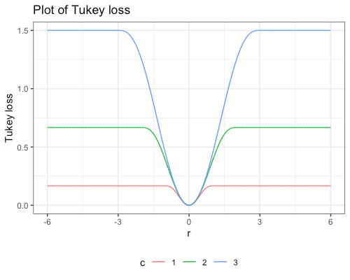

# oak_d_pc_measurement
This repo contains code capable of generating a point cloud measurement from OAK-D camera.

## Basic camera setup
OAK-D requires USB3 cable by default. If it is not available, USB2 communication needs to be [forced](https://docs.luxonis.com/en/latest/pages/troubleshooting/#forcing-usb2-communication). Before using OAK-D on the Linux machine, one needs to set udev rules. Following command needs to be ran with the OAK-D **unplugged**!

```
echo 'SUBSYSTEM=="usb", ATTRS{idVendor}=="03e7", MODE="0666"' | sudo tee /etc/udev/rules.d/80-movidius.rules
sudo udevadm control --reload-rules && sudo udevadm trigger
```

To test is the device detected and available:  `lsusb | grep MyriadX`

Note that the device needs to be plugged in **directly** into the machine (not via USB hub!) to utilize USB3 connection!

Hardware docs: https://docs.luxonis.com/projects/hardware/en/latest/index.html

### DepthAI & Python API setup (Ubuntu 20.04)
Docs:
- https://docs.luxonis.com/projects/api/en/latest/
- https://docs.luxonis.com/projects/api/en/latest/references/python/

Installation instructions (also with RPi & Jetson instructions): https://docs.luxonis.com/projects/api/en/latest/install/#installation

There are 2 main repositories that are to be utilized:
https://github.com/luxonis/depthai and https://github.com/luxonis/depthai-python. First one is  a main depthai library and the second one contains Python bindings.

- Create venv: `python3 - m venv venv`
- `source venv/bin/activate`
- `pip install -U pip`
- Clone main depthai library (C++): `git clone https://github.com/luxonis/depthai.git`
- `cd depthai && python3 install_requirements.py`
- Install depthai Python API library (if required): `python3 -m pip install depthai`
- Clone depthai-python repo: `git clone https://github.com/luxonis/depthai-python.git`
- `cd examples && python3 install_requirements.py`
- Test the camera: `python3 ColorCamera/rgb_preview.py`
- Hello world: https://docs.luxonis.com/projects/api/en/latest/tutorials/hello_world/#hello-world
- Code samples: https://docs.luxonis.com/projects/api/en/latest/tutorials/code_samples/#code-samples
- Extra repository with unstable but useful code: https://github.com/jjd9/depthai-experiments
- All samples are available inside depthai-python/examples

### Example results


What is interesting here is the loss function, also known as robust kernel. Tukey loss, used in this implementation, is a loss function that displays quadratic behaviour near the origin. It is very insensitive to outliers are the loss incurred by large residuals in constant (rather than scaling linearly). Figure below shows the plot of the Tukey loss for various values of the parameter c.


